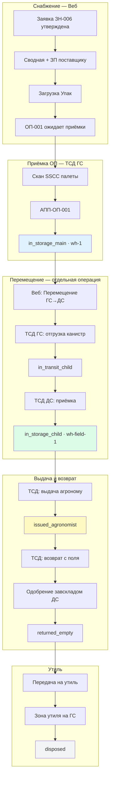

# Сценарий: путь одной демо-канистры ХСЗР от заявки до утилизации

## Назначение документа

Этот документ описывает **полный жизненный цикл одной конкретной канистры** в промо-приложении WMS (Атамекен MVP). Материал предназначен для загрузки в **Notebook LLM** как контекст для вопросов о бизнес-процессах, демонстрации и обучении пользователей.

Ключевой принцип системы: **все движения фиксируются сканированием на ТСД и подтверждаются двумя сторонами** (отправитель / получатель).

---

## Участники процесса

| Участник | Роль | OTP | Склад / зона | Система |
|----------|------|-----|--------------|---------|
| Нурланов Е.Т. | Администратор | `666` | Главный склад (все склады) | Веб + ТСД |
| Иванов А.С. | Завсклад ГС | `111` | `wh-1` Главный склад | ТСД |
| Ким В.Р. | Завсклад ДС №1 | `222` | `wh-field-1` Дочерний склад №1 | ТСД |
| Петров К.Н. | Агроном (МОЛ) | `333` | Поле / без склада | ТСД |
| Сидоров М.В. | Руководство | `444` | Головное предприятие | Веб |
| Отдел снабжения | Снабженец | `666` | — | Веб |

### Склады и предприятия

| ID склада | Название | Тип | Предприятие (демо) |
|-----------|----------|-----|---------------------|
| `wh-1` | Главный склад | ГС | Атамекен-Агро (головное) |
| `wh-field-1` | Дочерний склад №1 | ДС | ТОО 1 |
| `wh-field-2` | Дочерний склад №2 | ДС | ТОО 2 |

### Демо-заявки на спрос

| Номер | Предприятие | Склад назначения | Маршрут поставки |
|-------|-------------|------------------|------------------|
| ЗН-006 | ТОО 1 | ДС №1 | **ГС → ДС №1** |
| ЗН-007 | ТОО 2 | ДС №2 | **ГС → ДС №2** |

> Склад назначения в заявке — это **конечная точка после перемещения**, а не место приёмки ОП.

---

## Паспорт демо-канистры

| Поле | Значение |
|------|----------|
| **ID в системе** | `can-demo-341x1302` |
| **Серийный номер** | `341X1302R9S18` |
| **SGTIN** | строится из GTIN + серийника |
| **Препарат** | Торнадо 540, ВР (540 г/л) |
| **Объём** | 10 л |
| **Партия** | `3260002513` |
| **Срок годности** | 18.03.2031 |
| **Палета (SSCC)** | `146700499966112311` |
| **Короб (SSCC)** | `146700499966111680` |
| **Поставщик** | Поставщик «Август» |
| **Ожидаемая приёмка** | ОП-001 |

Эта канистра — **первая канистра первой палеты** в файле Упак и используется как эталон для отслеживания пути в демо.

---

## Цепочка статусов (15 этапов)

Полная цепочка из доменной модели (`CANISTER_STATUS_CHAIN`):

| № | Статус (код) | Краткое название | Склад / локация |
|---|--------------|------------------|-----------------|
| 1 | `expected_receipt` | Ожидание | Ожидаемая приёмка ОП |
| 2 | `received_acceptance` | Приёмка | Зона приёмки ГС |
| 3 | `in_storage_main` | Хранение на ГС | Главный склад, ячейка A-01-03 |
| 4 | `reserved` | Резерв | Главный склад |
| 5 | `picking` | Отбор | Главный склад |
| 6 | `ready_to_ship` | К отгрузке | Главный склад |
| 7 | `in_transit_child` | В пути | ГС → ДС |
| 8 | `received_child` | Приём на ДС | Дочерний склад |
| 9 | `in_storage_child` | Хранение на ДС | Дочерний склад |
| 10 | `issued_agronomist` | У агронома | МОЛ / поле |
| 11 | `returned_empty` | Возврат тары | Дочерний склад |
| 12 | `for_disposal_child` | К утилю | Дочерний склад |
| 13 | `in_transit_disposal` | Транзит на утиль | ДС → зона утиля |
| 14 | `in_disposal_zone` | В зоне утиля | Зона утилизации |
| 15 | `disposed` | Утилизировано | Конец жизненного цикла |

> В промо-демо этапы 4–6 (резерв / отбор / к отгрузке) могут быть **пропущены**: перемещение ГС→ДС идёт напрямую со статуса `in_storage_main`.

---

## Ключевые бизнес-правила

1. **Приёмка ОП — только на главный склад.** Поставка от дистрибьютора всегда принимается на `wh-1`, независимо от того, для какого ТОО/ДС сформирован спрос.
2. **Перемещение на дочерний склад — отдельная операция.** Создаётся вручную в веб-разделе «Снабжение» кнопкой «Перемещение ГС → ДС» только после приёмки ОП (статус заявки `partially_fulfilled`).
3. **Двойное подтверждение перемещения:** отгрузка с ГС (отправитель) → приёмка на ДС (получатель). Приёмка на ДС недоступна, пока не завершена отгрузка с ГС.
4. **Возврат с поля** требует одобрения завсклада ДС (задача `awaiting_receiver_confirmation`).
5. **Утиль** — через главный склад: пустая тара сначала накапливается на ДС, затем передаётся в зону утилизации.

---

## Пошаговый сценарий (демо-канистра `341X1302R9S18`)

### Фаза A. Снабжение (веб, OTP `666`)

#### Шаг 1. Формирование спроса

| | |
|---|---|
| **Актор** | Снабженец (Нурланов Е.Т.) |
| **Система** | Веб → Снабжение |
| **Действие** | Утвердить заявки **ЗН-006** (ТОО 1) и **ЗН-007** (ТОО 2). Сформировать сводную потребность. |
| **Скан** | — |
| **Документы** | Сводная СВ-00X, заявка поставщику ЗП-00X |
| **Статус канистры** | — → `expected_receipt` (после загрузки Упак) |
| **Склад** | Ожидаемая приёмка ОП-001 |

#### Шаг 2. Загрузка файла Упак

| | |
|---|---|
| **Актор** | Снабженец |
| **Система** | Веб → Снабжение → Заявки поставщику |
| **Действие** | Отправить ЗП поставщику, загрузить файл **Упак** |
| **Скан** | — |
| **Документы** | ОП-001 (ожидаемая приёмка), иерархия палета→короб→канистра |
| **Статус заявок** | `approved` → `awaiting_delivery` |
| **Статус канистры** | `expected_receipt` |
| **Склад** | В пути от поставщика |
| **Автоматически** | Создаётся складская задача **приёмки ОП** на ГС |

---

### Фаза B. Приёмка ОП на главном складе (ТСД, OTP `111`)

#### Шаг 3. Приёмка палеты по ОП

| | |
|---|---|
| **Актор** | Кладовщик ГС (Иванов А.С.) |
| **Система** | ТСД → задача «Приёмка · Главный склад» |
| **Действие** | Открыть задачу по ОП-001. Нажать «Сканировать» / «Сканировать всё». Подтвердить «Принять». |
| **Скан** | SSCC палеты: `146700499966112311` |
| **Документы** | Акт приёма поставки **АПП-ОП-001** |
| **Статус канистры** | `expected_receipt` → `in_storage_main` |
| **Склад** | `wh-1` Главный склад, ячейка A-01-03 |
| **Статус заявок** | `awaiting_delivery` → `partially_fulfilled` |

> **Важно:** на этом шаге канистра попадает **только на главный склад**. На ДС №1 она ещё не прибыла.

---

### Фаза C. Перемещение ГС → ДС (отдельная операция)

#### Шаг 4. Создание пары задач перемещения (веб)

| | |
|---|---|
| **Актор** | Снабженец (`666`) |
| **Система** | Веб → Снабжение → Заявка **ЗН-006** |
| **Действие** | Нажать **«Перемещение ГС → Дочерний склад №1»** |
| **Скан** | — |
| **Документы** | Пара складских задач: отгрузка (ГС) + приёмка (ДС №1) |
| **Статус канистры** | `in_storage_main` (без изменений) |
| **Склад** | `wh-1` |

> Перемещение для ЗН-007 создаётся отдельно и ведёт на ДС №2.

#### Шаг 5. Отгрузка с главного склада (ТСД)

| | |
|---|---|
| **Актор** | Кладовщик ГС (`111`) |
| **Система** | ТСД → задача «Отгрузка с ГС» |
| **Действие** | Сканировать канистру / «Сканировать всё» → «Завершить отгрузку» |
| **Скан** | `341X1302R9S18` или SGTIN канистры |
| **Документы** | Акт приёма-передачи **АПП-T-№X** |
| **Статус канистры** | `in_storage_main` → `in_transit_child` |
| **Склад** | В пути: ГС → ДС №1 |
| **Статус заявки** | `partially_fulfilled` → `in_transit` |

#### Шаг 6. Приёмка на дочернем складе (ТСД)

| | |
|---|---|
| **Актор** | Кладовщик ДС №1 (`222`) |
| **Система** | ТСД → задача «Приёмка на ДС» (появляется после завершения отгрузки с ГС) |
| **Действие** | Сканировать канистры из отгрузки → «Завершить приём» |
| **Скан** | `341X1302R9S18` |
| **Документы** | Закрытие акта приёма-передачи |
| **Статус канистры** | `in_transit_child` → `in_storage_child` |
| **Склад** | `wh-field-1` Дочерний склад №1 |
| **Статус заявки** | `in_transit` → `fulfilled` (при полном закрытии) |

---

### Фаза D. Выдача агроному (ТСД)

#### Шаг 7. Выдача МОЛ

| | |
|---|---|
| **Актор** | Кладовщик ДС (`222`) или автономная выдача |
| **Система** | ТСД → «Выдача агроному» |
| **Действие** | Сканировать SGTIN / серийник канистры |
| **Скан** | `341X1302R9S18` |
| **Документы** | Акт выдачи **АВ-XXXXXX** |
| **Статус канистры** | `in_storage_child` → `issued_agronomist` |
| **Склад** | У агронома (МОЛ) |

---

### Фаза E. Возврат с поля (ТСД + одобрение)

#### Шаг 8. Возврат тары агрономом

| | |
|---|---|
| **Актор** | Агроном (`333`) |
| **Система** | ТСД → «Возврат с поля» |
| **Действие** | Сканировать канистру, указать состояние (пустая / полупустая / полная). Для непустой — фото и остаток в литрах. |
| **Скан** | `341X1302R9S18` |
| **Документы** | Акт возврата **АВозвр-XXXXXX** |
| **Статус канистры** | `issued_agronomist` → `returned_empty` (или `returned_half_empty` / `returned_full`) |
| **Склад** | Ожидает одобрения на ДС №1 |

#### Шаг 9. Одобрение возврата завскладом

| | |
|---|---|
| **Актор** | Кладовщик ДС (`222`) |
| **Система** | ТСД → задача «Одобрение» (статус `awaiting_receiver_confirmation`) |
| **Действие** | Проверить состояние тары, подтвердить или отклонить возврат |
| **Скан** | — (подтверждение по задаче) |
| **Документы** | Обновление акта возврата |
| **Статус канистры** | `returned_empty` (принято на ДС) |
| **Склад** | `wh-field-1` |

---

### Фаза F. Утилизация

#### Шаг 10. Передача на утиль

| | |
|---|---|
| **Актор** | Кладовщик ДС (`222`) |
| **Система** | ТСД → Утиль |
| **Действие** | Сканировать пустую канистру для передачи в зону утиля |
| **Скан** | `341X1302R9S18` |
| **Документы** | Накладная на утиль |
| **Статус канистры** | `returned_empty` → `for_disposal_child` → `in_transit_disposal` |
| **Склад** | В пути на утиль |

#### Шаг 11. Приём в зону утиля и списание

| | |
|---|---|
| **Актор** | Кладовщик ГС (`111`) — утиль через главный склад |
| **Система** | ТСД / Веб |
| **Действие** | Принять в зону утиля, подтвердить списание |
| **Скан** | `341X1302R9S18` |
| **Документы** | Акт утилизации |
| **Статус канистры** | `in_disposal_zone` → `disposed` |
| **Склад** | Зона утилизации |

---

## Диаграмма потока (Mermaid)

---

## Чеклист демо-прохождения (путь ЗН-006, канистра `341X1302R9S18`)

### Подготовка

- [ ] Очистить демо-состояние: `localStorage.removeItem('wms-promo-state-v11')`
- [ ] Перезагрузить приложение `http://localhost:3000`

### Снабжение (веб, OTP `666`)

- [ ] Войти в веб-кабинет
- [ ] Снабжение → фильтр **«Все предприятия»**
- [ ] Отметить **ЗН-006** и **ЗН-007** → **«Сформировать сводную»**
- [ ] Утвердить сводную → автоматически создаётся ЗП
- [ ] Вкладка «Поставщик» → отправить ЗП → **загрузить Упак**
- [ ] Убедиться: создана ожидаемая приёмка **ОП-001**, заявки в статусе «Ожидает поставки»

### Приёмка ОП (ТСД, OTP `111`, ГС)

- [ ] Войти на панели ТСД как кладовщик ГС
- [ ] Открыть задачу **«Приёмка · Главный склад»** по ОП-001
- [ ] Сканировать палету `146700499966112311` (или «Сканировать всё»)
- [ ] Нажать **«Принять»**
- [ ] Проверить: заявки **ЗН-006 / ЗН-007** → «Частично закрыта»; канистра на ГС

### Перемещение (веб + ТСД)

- [ ] Веб: открыть **ЗН-006** → **«Перемещение ГС → Дочерний склад №1»**
- [ ] ТСД (`111`): задача отгрузки → сканировать канистру → **«Завершить отгрузку»**
- [ ] ТСД (`222`): задача приёмки на ДС → сканировать → **«Завершить приём»**
- [ ] Проверить: канистра на `wh-field-1`, статус `in_storage_child`

### Выдача и возврат

- [ ] ТСД (`222` или `333`): **Выдача** → скан `341X1302R9S18`
- [ ] ТСД (`333`): **Возврат с поля** → пустая тара
- [ ] ТСД (`222`): **Одобрение возврата** в карточке задачи

### Утиль

- [ ] ТСД: передать канистру на утиль → принять в зону утиля на ГС → списать
- [ ] Проверить: статус `disposed`, маршрут завершён

---

## Сводная таблица: статус × склад × документ

| Этап | Статус до | Статус после | Склад | Документ |
|------|-----------|--------------|-------|----------|
| Упак | — | `expected_receipt` | ОП | ОП-001 |
| Приёмка ОП | `expected_receipt` | `in_storage_main` | wh-1 | АПП-ОП-001 |
| Отгрузка ГС | `in_storage_main` | `in_transit_child` | в пути | АПП-T-№X |
| Приёмка ДС | `in_transit_child` | `in_storage_child` | wh-field-1 | закрытие АПП |
| Выдача | `in_storage_child` | `issued_agronomist` | МОЛ | АВ-XXXXXX |
| Возврат | `issued_agronomist` | `returned_empty` | wh-field-1 | АВозвр-XXXXXX |
| Утиль | `returned_empty` | `disposed` | зона утиля | акт утилизации |

---

## Частые ошибки в демо

| Ошибка | Причина | Решение |
|--------|---------|---------|
| «Перемещение доступно после приёмки на ГС» | ОП ещё не принято | Сначала выполнить шаг приёмки ОП на ТСД ГС |
| «Нечего сканировать» на приёмке ДС | Отгрузка с ГС не завершена | Завершить отгрузку на ТСД (`111`) |
| «На главном складе нет канистр» | Пропущена приёмка ОП | Принять палету по ОП-001 |
| Двойной счёт канистр при автоскане | Дубли кодов serial/sgtin | Используется дедупликация; прогресс = уникальные канистры |
| Перемещение видно до ОП | Старый флоу | Обновить состояние до v11; перемещение только после `partially_fulfilled` |

---

## Глоссарий

| Термин | Значение |
|--------|----------|
| **ОП** | Ожидаемая приёмка — документ входящей поставки от поставщика |
| **Упак** | Файл импорта иерархии палета→короб→канистра от дистрибьютора |
| **ГС** | Главный склад (`wh-1`) |
| **ДС** | Дочерний склад (`wh-field-1`, `wh-field-2`) |
| **МОЛ** | Материально ответственное лицо (агроном) |
| **SGTIN** | Глобальный идентификатор товарной единицы (штрихкод канистры) |
| **SSCC** | Идентификатор логистической единицы (палета / короб) |
| **АПП** | Акт приёма-передачи |
| **Handshake** | Двустороннее подтверждение операции отправителем и получателем |

---

*Документ сгенерирован для промо-приложения WMS · репозиторий `WMS` · демо-канистра `can-demo-341x1302`*
